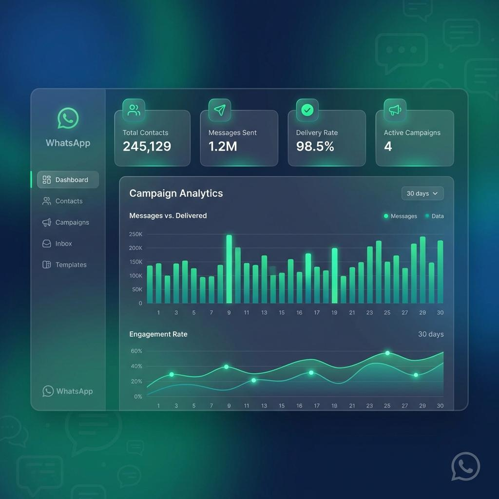
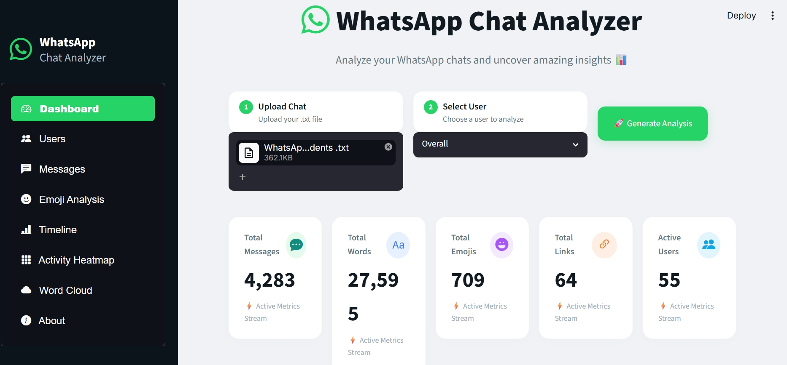
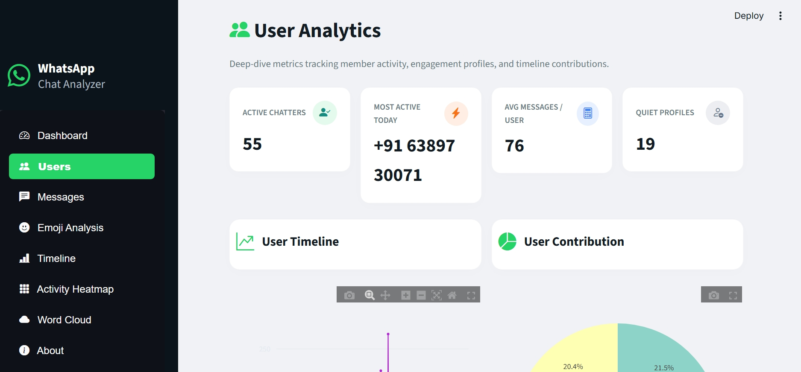
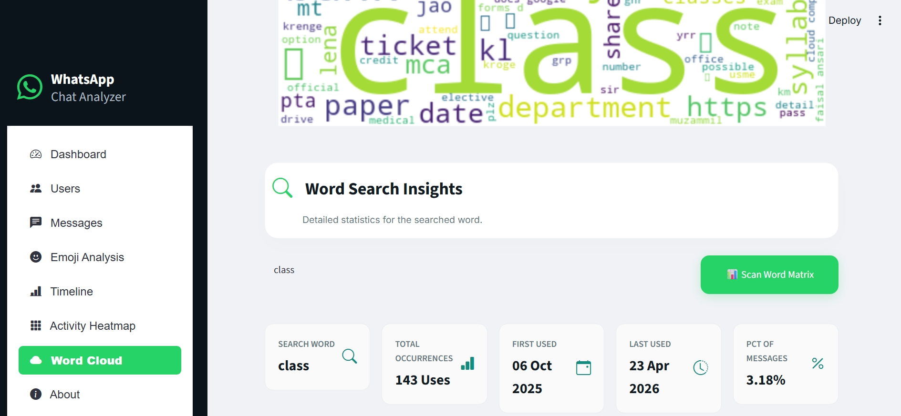
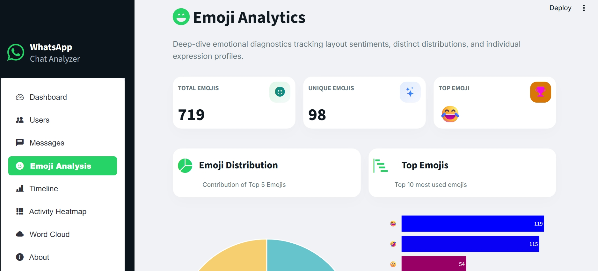

# 📱 WhatsApp Chat Analyzer

<p align="center">
  <b>Transform your WhatsApp conversations into meaningful insights with interactive dashboards, NLP, and beautiful visualizations.</b>
</p>

<p align="center">
  
</p>

<p align="center">
  
  
  
  
  
</p>

---

## 🚀 Overview

**WhatsApp Chat Analyzer** is an end-to-end data analytics application built with **Python** and **Streamlit**. Simply upload an exported WhatsApp chat and explore detailed insights through interactive dashboards, advanced text analysis, and visually appealing charts.

Whether you want to understand chat activity, user engagement, emoji usage, timelines, or frequently used words, this application provides everything in one place.

---

# ✨ Features

### 📊 Dashboard
- Overall chat statistics
- KPI cards
- Monthly timeline
- Daily timeline
- Most Active Users
- Monthly Activity
- Weekly Activity

### 👥 User Analysis
- KPI cards`(Active Chatters,Most Active Today,Avg Messages / User,Quiet Profiles)`
- User ranking
- User contribution
- User timeline
- User statistics

### 💬 Message Analysis
- KPI cards`(Total messages,Media messages,Deleted messages)`
- Message length distribution
- Most Common Words
- Most Used Phrases

### 😀 Emoji Analysis
- KPI cards`(Total Emojis,Unique Emojis,Top Emoji)`
- Emoji distribution
- Top emojis
- User statistics


### 📈 Timeline Analysis
- Monthly activity
- Daily activity
- Hourly activity
- Yearly activity
- User trends
- Custom date filtering

### 🔥 Activity Heatmap
- Most Active Hour
- Most Active Day
- Weekly activity heatmap
- Hourly activity heatmap

### ☁️ Word Cloud & NLP
- Interactive Word Cloud
- Search word insights
- Word frequency statistics

---

# 📸 Screenshots


| Dashboard | User Analysis |
|------------|---------------|
|  |  |

| Word Cloud | Emoji Analysis |
|------------|----------------|
|  |  |

---

# 🛠 Tech Stack

| Category | Technologies |
|----------|--------------|
| Language | Python |
| Framework | Streamlit |
| Data Analysis | Pandas, NumPy |
| Visualization | Matplotlib, Seaborn,Plotly |
| NLP | Regex, WordCloud |
| Emoji Processing | emoji |
| Version Control | Git, GitHub |

---

# 📂 Project Structure

```text
WhatsApp-Chat-Analyzer/
│
├── app.py
├── preprocessor.py
├── helper.py
├── stop_hinglish.txt
├── assets/
├── screenshots/
├── requirements.txt
├── README.md
└── gitignore.txt

```

---

# ⚙️ Installation

Clone the repository

```bash
git clone https://github.com/Ammarqasmi03/whatsApp-chat-analyzer.git
```

Move into the project folder

```bash
cd WhatsApp_Chat_Analyzer
```

Create a virtual environment

```bash
python -m venv prject_env
```

Activate the environment

Windows

```bash
prject_env\Scripts\activate
```

Linux / macOS

```bash
source venv/bin/activate
```

Install dependencies

```bash
pip install -r requirements.txt
```

Run the application

```bash
streamlit run app.py
```

---

# 📊 Insights Generated

The application can analyze:

- 📨 Total Messages
- 👥 Active Users
- 📅 Monthly Activity
- 📆 Daily Activity
- ⏰ Hourly Activity
- 🔥 Weekly Heatmap
- 😀 Emoji Usage
- 🔗 Link Sharing
- ☁️ Word Cloud
- 📖 Most Common Words
- 🔍 Search Word Statistics
- 📈 User Trends
- 📊 User Contributions

---

# 💡 Future Improvements

- AI-powered chat summarization
- Sentiment analysis
- Multi-language support
- Chat comparison
- Topic modeling
- PDF report generation
- Export dashboards as images
- Interactive Plotly charts

---

# 🤝 Contributing

Contributions are welcome!

1. Fork the repository
2. Create a new feature branch
3. Commit your changes
4. Push to your branch
5. Open a Pull Request

---

# 👨‍💻 Developer

## Ammar Gour

**AI & Machine Learning Enthusiast**

Master of Computer Applications (MCA)

Interested in:

- Machine Learning
- Data Science
- Natural Language Processing
- Computer Vision
- Data Visualization

---

# 🌐 Connect With Me

- 💼 LinkedIn: https://linkedin.com/in/ammar-qasmi-082266289/
- 💻 GitHub: https://github.com/Ammarqasmi03/
- 🌍 Portfolio: https://ammarqasmi03.github.io/my-portfilio/
- 📧 Email: ammarqasmi76@gmail.com

---

# ⭐ Support

If you found this project helpful, consider giving it a ⭐ on GitHub.

It helps others discover the project and motivates further development.

---

<p align="center">
Made with ❤️ using Python, Streamlit, and Data Analytics.
</p>